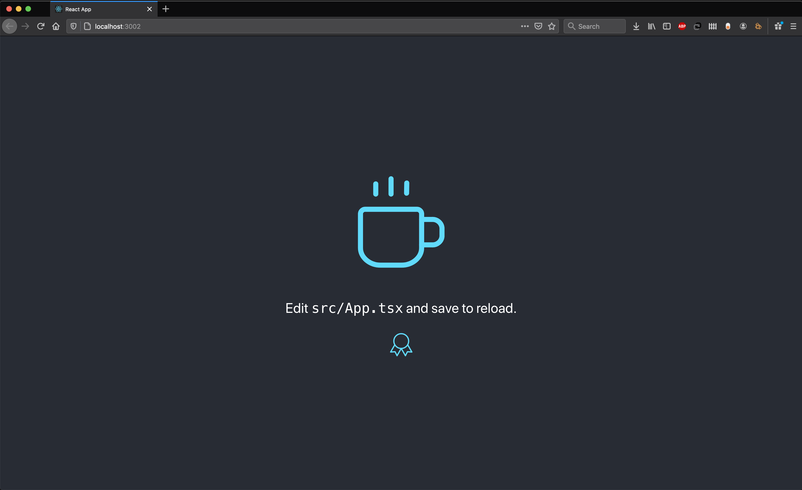

# react-ui-study
An experimental study on react in combination with svg graphics

## Chapter 1

A Bolierplate `create-react-app` with `@tabler/icons` and an additional icon `IconMugSteam`, similar to tabler icons as a react component, following the same logic of exposing svg parameters to to be scriptable.

### Example
```typescript
import { IconMugSteam } from './icons/IconMugSteam';

const MyComponent = () => {
  return <IconMugSteam
    className="App-logo" // Makes it spin
    alt="logo" // Needed for Google
    size={256} // Big and fancy
    color="#61DAFB" // "React" color
    stroke={1}  // Nice and slim
  />
}
```